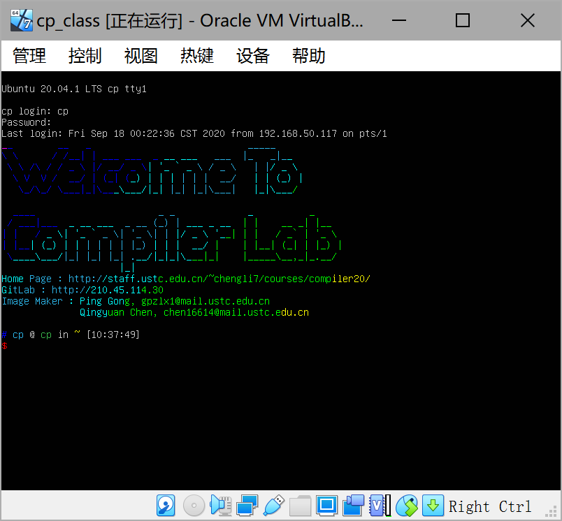

# 编译原理实验环境搭建

本文档用于指导编译原理实验环境搭建。

本课程使用的核心软件版本为：

* ubuntu20.04 (大家系统最好和我们保持一致)

* LLVM 10.0.1
* Flex 2.6.4
* Bison 3.5.1


**后续不接受因软件版本不一致而导致的任何迟交、错交、误交理由。**

---

**经HNU助教验证、推荐搭配：**

[**Win 10 使用 WSL 「推荐」**](https://iceyblacktea.vercel.app/blog/install-wsl2) （应该是最方便的）

**Tips**.安装LLVM可以直接在Linux下命令行输入 `sudo apt-get install llvm bison flex`

安装完成后可以输入

`flex --version`

`bison --version`

查看版本

或者其他指令检查安装，请同学们自行探索~

---

除此之外，我们提供了下列种方法供大家选择：

1. [**使用提供的虚拟机镜像（需要较好的网络）【推荐】**](#虚拟机镜像选项一)
2. [使用docker镜像 （需要一定的技术力）](#docker-镜像选项二) 
3. [自己搭建编译环境 （需要机器有足够的算力和存储空间）](#自己搭建和编译选项三)
4. [探索性搭建](#探索性搭建选项四)
## 虚拟机镜像(选项一)

#### 注意

这里用到的系统默认为`Windows`

使用虚拟机需要确定计算机已经启用`VT (Intel)`或者`SVM (AMD)`，具体过程参考谷歌/百度。确认是否已开启，可通过任务管理器查看。


#### 具体过程

* step 1) 下载并安装VirtualBox，VirtualBox是一款优秀的虚拟机软件，能够提供接近原生系统的虚拟化性能。https://www.virtualbox.org/

* step 2) 下载虚拟机镜像文件，该镜像文件大小为9.4G，存储在 https://rec.ustc.edu.cn/share/e8e24bd0-f9ae-11ea-ab81-cff1818c8da4 。我们使用了学校睿客网盘系统，该系统下载可能会中断（大概每下载1G中断一次），请确保下载时有较好的网络。当下载失败时，点击继续即可。（推荐使用谷歌浏览器下载）
 
  
* step 3) 打开 VB (VirtualBox)，点击`新建`，点击`下一步`。

  

  随后在`虚拟磁盘`处选择助教提供的虚拟磁盘文件即可。

  

* step 4) 启动登录即可。最终你将得到如下界面。

  


  通过以下验证信息即可登录进入系统。
  * username : cp
  * password : cp


  

#### 额外

VirtualBox ： 提供了一系列强大的功能，推荐大家自行摸索，相互交流。


## Docker 镜像(选项二)

Docker 是流行的容器管理器，且借助于虚拟化技术，可以在多种操作系统下运行，十分方便。

本课程提供的 Docker 镜像主要用于交互式使用，类似于轻量级的虚拟机。对于不了解 Docker 的同学，本文档只提供最少的讲解让你可以启动容器，除此之外一概不讲。如有兴趣，请自行了解。

### 概念

最重要的两个概念是「容器」和「镜像」。

* 容器：类比于「虚拟机」。（也可类比作「进程」。）
* 镜像：类比于「装某个虚拟机用的 ISO 文件」。（也可类比作「可执行文件」。）

技术上说，容器和虚拟机有不少差别，不过对我们的实验来说了解到这里就足够了。

### 用法

#### 安装并启动 Docker

参考官方文档 [Get Docker](https://docs.docker.com/get-docker/)。

在使用 Docker 时，请确保 Docker daemon 正在运行。

* macOS, Windows：打开 Docker Desktop，确认看到提示 Docker Desktop is running。
* Linux：参考相应发行版的文档。以 systemd 为例，参考文档 [Control Docker with systemd](https://docs.docker.com/config/daemon/systemd/)。

#### 下载镜像

```bash
docker pull ksqsf/llvm
```

注：可使用 [USTC 镜像](https://mirrors.ustc.edu.cn/help/dockerhub.html) 加速。

下载后，可用 `docker image ls` 命令确认。

#### 创建与查看容器

```bash
docker create \
  --name compiler-labs \
  -v "$(realpath 宿主机上的目录路径):/labs" \
  -it ksqsf/llvm
```

上述命令将创建该容器。如果一切顺利，你将可以看到一串十六进制数（容器 ID）打印出来。此时，使用 `docker ps -a` 可以看到出现了一个新的容器。（`ps` 默认只输出正在运行的容器，因此使用 `-a` 强制输出所有容器。）

参数的含义是：

* `--name` 赋予该容器一个名字。
* `-v $DIR_PATH:/labs` 将创建一个「共享文件夹」，路径在 `/labs`。可以通过这个目录来与宿主机交换文件。
  * `$DIR_PATH` 必须是绝对路径，因此使用了 `realname`。
  * 也可以选择其他自己喜欢的路径。
* `-i` 表示创建交互式容器。
* `-t` 表示分配伪 TTY。

### 进入容器环境

```bash
docker start -ai compiler-labs
```

你将可以看到一个 bash 命令行，表示已经在 Ubuntu 环境中了。退出 shell 后，可以再次使用该命令回到容器环境中，并且对环境作出的修改仍将保留着（除非你删除了这个容器，或者不小心进入了另一个容器，或者在创建容器时错误地使用了 `--rm` 参数）。

如果报错 `Error response from daemon: dial unix docker.raw.sock: connect: connection refused`，请检查是否启动了 Docker 引擎。

参数说明：

* `compiler-labs` 是创建时的 `--name` 参数。
* `-a` 表示 attach。
* `-i` 表示 interactive。

用于实验的 LLVM Docker 镜像提供以下内容：

* LLVM 10.0.1
  * `/llvm`：头文件和已编译安装好的二进制文件等
  * `/llvm-src`：LLVM 源代码
* Flex 2.6.4
* Bison 3.5.1
* CMake 3.16.3
* GCC, G++ 9.3.0

此外，默认 `PATH` 含有 `/llvm/bin` ，故可以直接使用 `clang` 和 LLVM 提供的工具。

#### 删除容器和镜像

```
docker rm compiler-labs
docker rmi ksqsf/llvm
```

可用 `docker container ls -a` 列出所有容器，用 `docker image ls -a` 列出所有镜像。

### 其他事项

macOS 和 Windows 的 Docker 默认对内存等资源有所限制，如果要在容器环境中编译 LLVM，请注意调整资源限制（Preferences → Advanced）。


## 自己搭建和编译(选项三)

#### 注意

编译`llvm`需要至少**15~20G**磁盘空间，**编译时间较长**（基本几个小时），请谨慎选择此方法。这里用到的系统,假设为`Ubuntu 20.04`, 我们推荐大家(尤其是不太熟悉Linux的同学)采用这个系统. 如果你实在想采用其他系统,请自行准备好环境，但是在实验提交中应避免对其他Linux/MacOS发行版环境的依赖。

#### 下载和编译源码


* Step 1) 首先是一些必要依赖的安装
  ``` bash
  sudo apt-get install -y cmake xz-utils build-essential wget
  ```
  
* Step 2) 在仓库之外,选择好你的工作目录,下载源码,最后得到名为`llvm`的目录
  ``` bash
  # 下载
  wget https://github.com/llvm/llvm-project/archive/llvmorg-10.0.1.tar.gz
  # 解压缩
  tar zxvf llvmorg-10.0.1.tar.gz
  mv llvm-project-llvmorg-10.0.1 llvm
  ```
  
* Step 3) 编译并安装.这里在内存及硬盘充足的条件下,推荐`Debug`配置的编译,这更能让你体验"较大的项目"的编译过程.否则请采用`Release`配置的编译
  ``` bash
  #创建安装路径
  mkdir ~/llvm-install
  #开始编译
  cd llvm && mkdir build && cd build
  # Release
  cmake  -DLLVM_ENABLE_PROJECTS="clang" -DCMAKE_BUILD_TYPE=Release  -DCMAKE_INSTALL_PREFIX=$HOME/llvm-install ../llvm
  # Debug
  cmake  -DLLVM_ENABLE_PROJECTS="clang" -DCMAKE_BUILD_TYPE=Debug  -DCMAKE_INSTALL_PREFIX=$HOME/llvm-install ../llvm
  # 编译安装,下面的N表示的是你采取的同时执行的编译任务的数目.你需要将其替换为具体的数值,如8,4,1
  # 如果内存充足,一般推荐将N设置为cpu核数的2倍,如果未指明N,将会尽可能多地并行编译
  make -j N
  # 这一过程可能有半小时至两小时不等,如果内存不足,可以尝试减小N并重新make,已经编译好的部分不会重新编译，这个过程可能会持续几个小时
  # 安装
  make install
  ```
  
* Step 4) 配置PATH,使得生成的二进制文件方便使用.配置PATH在以后的工作中也会是经常用到的,希望大家熟练掌握(或者至少熟练如何搜索)
  ``` bash
  # 将llvm-install/bin目录的完整路径,加入到环境变量PATH中
  # 假设该完整路径为the_path_to_your_llvm-install_bin,
  # 如果你的默认shell是zsh,可以在~/.zshrc中加入一行:
  export PATH=the_path_to_your_llvm-install_bin:$PATH
  # 然后执行
  source ~/.zshrc
  # 如果你的默认shell是bash,欢迎自行google/baidu

  # 最后,检查PATH配置是否成功,执行命令:
  clang --version
  # 成功标志:
  10.0.1 #或类似
  # 失败标志:
  zsh: command not found: clang #或类似
  ```
  
* Step 5) 其他一些本课程需要的环境安装

  ```shell
  sudo apt install flex bison
  ```

####  测试

我们准备了一个简单的例子，供大家测试编译是否成功，假设下面的文件为`gcd.c`

```c
int gcd (int u, int v) { /* calculate the gcd of u and v */
  if (v == 0) return u;
  else return gcd(v, u - u / v * v); /* v,u-u/v*v is equals to u mod v*/
}
int main() {
  int x; int y; int temp;
  x = 72;
  y = 18;
  if (x<y) {
    temp = x;
    x = y;
    y = temp;
  }
  return gcd(x,y);
}
```

通过`clang -S -emit-llvm gcd.c`可以生成的LLVM IR文件`gcd.ll`

通过`lli gcd.ll`来测试执行结果的正确性.执行结果可以在shell中通过`echo $?`来查看:
``` bash
$ clang -S -emit-llvm gcd.c
$ lli gcd.ll
$ echo $? # $?得到的是上一个命令的返回结果
> 18
```

如果以上结果没有问题，恭喜你顺利完成环境的搭建。

## 探索性搭建(选项四)

如果编译出现问题，我们这里提供编译好的`llvm-releas_ubuntu2004_x86_64`包，供大家使用。欢迎同学们自行探索代价最小的环境搭建方案，发布`issue`进行分享。

* 链接：https://rec.ustc.edu.cn/share/8c7f8800-fa22-11ea-a228-89984d08d186
* md5: `80a3629cb908db635731b72cce54bd3a`
* sha1: `94e398150fe163c034ce75e7224ed5a592bea6bd`
* sha256: `c946192103c15e5c6dcceb8b946bc4285201e09360e28c7cf3e452c65cc7b5b5`